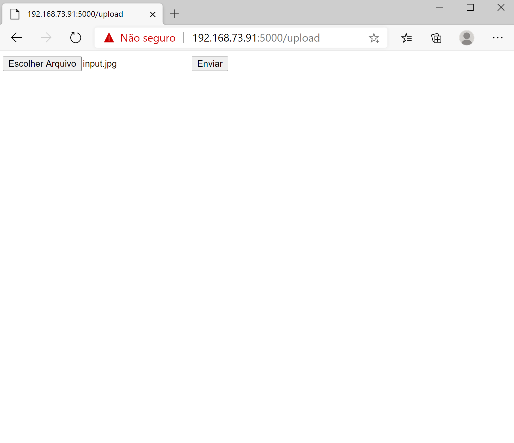
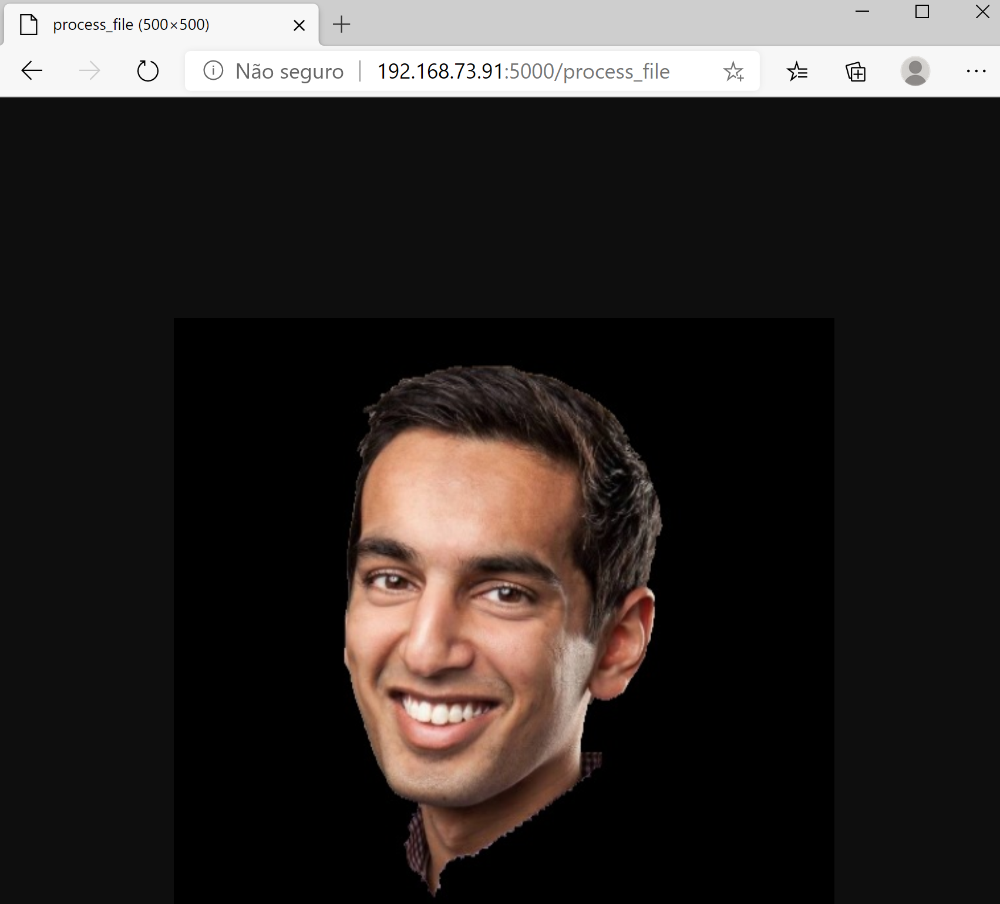
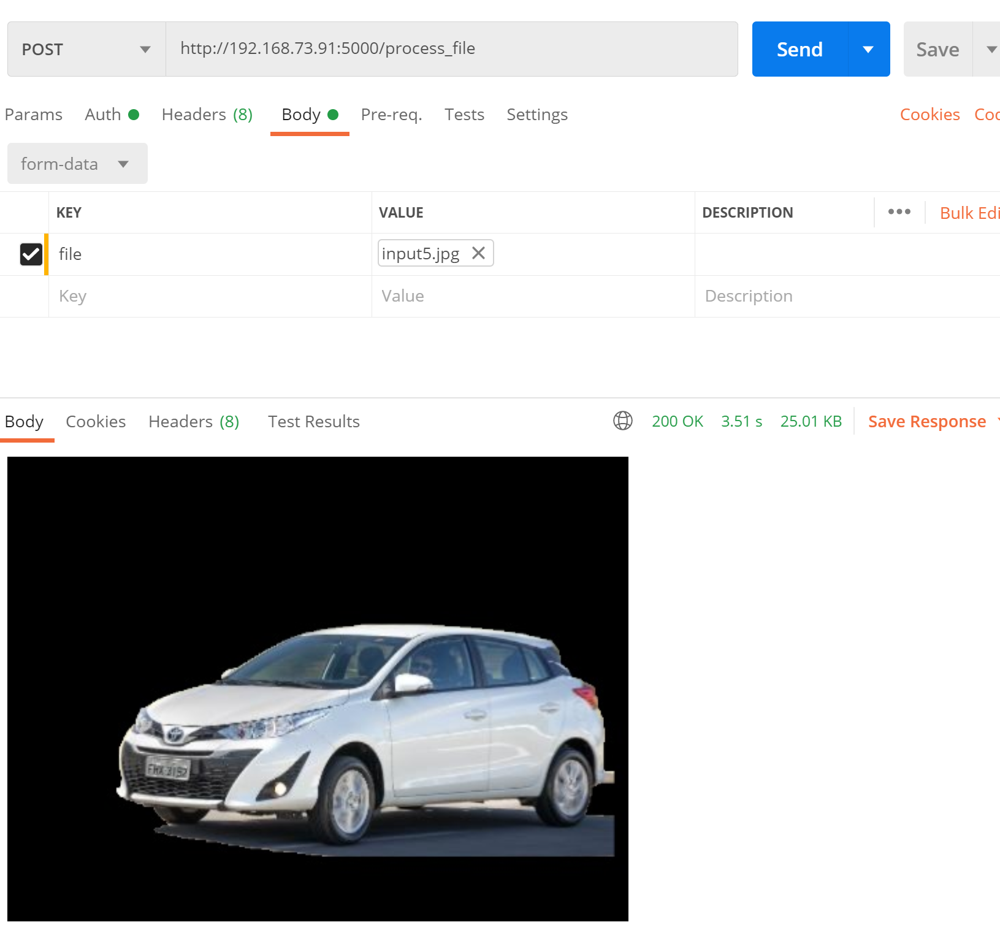
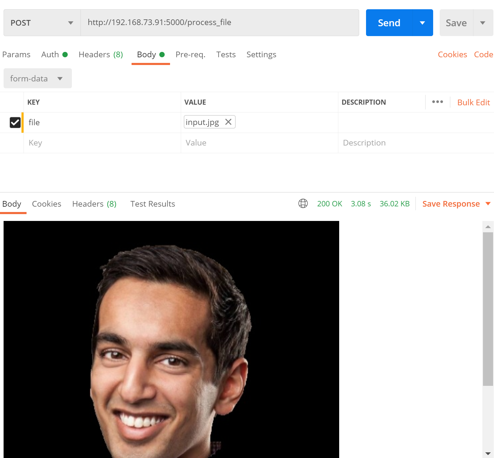
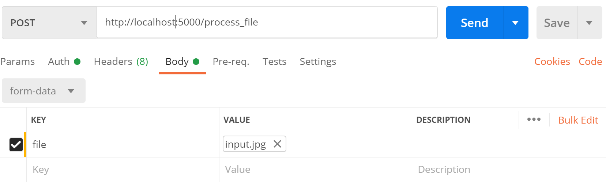

# Solutions for Optical flow e tracking
## 3\) Model Deployment \(Web/Docker\)
Description Solutions
O algoritmo usa o grabcut do opencv para realizar a retirada do background da imagem, para pegar a área de interesse é ultilizada uma rede de detecção de objetos, a YOLOV3, a mesma seleciona o primeiro objeto que ela achar na imagem e retorna o boundbox, que é passado para a função grabcut do opencv que realizará o processamento e retornará a imagem processada. 
#### Exemplos de execução 
- via browser
    - 
    - 
- via Postman
    - 
    - 

###### Usando o docker:
```bash
#faça o clone do repositório.
$ git clone https://github.com/natorjunior/computer_vision_response_exercises.git
#Entre no diretório '3 - Model Deployment (WebDocker)'/flask_code
$ cd computer_vision_response_exercises/3\ -\ Model\ Deployment\ \(WebDocker\)/flask_code
#Faça o build do Dockerfile
$ docker build -t web_aplication_flask:latest .
#Faça a execução do container 
$ docker run -d -p 5000:5000 web_aplication_flask:latest
```
###### Dockerfile:
```bash
FROM python:3.6
ADD . /code
WORKDIR /code
RUN pip install -r requirements.txt
ENTRYPOINT ["python"]
CMD ["app.py"]
```
#### Fazendo a requisição via Postman:

#### Fazendo a requisição via Browser:


Methods flask function
```python
#função para calcular o boundbox da imagem 
def process_image(path_img):
    return path_new_img
#função para renderizar o formulario de upload
@app.route('/upload')
def upload_file():
    return render_template('upload.html')
#função para processar e responder a imagem processada
@app.route('/process_file', methods = ['GET', 'POST'])
def respinse_upload():
    return send_file(path_img, mimetype='')
```

###### Para execução do notebook separadamente, instale as dependências :

```sh
$ pip install -U requeriments.txt
```
or 

```sh
$ pip install flask
$ pip install Werkzeug
$ pip install matplotlib
$ pip install opencv-contrib-python
```

Usage libs
```python
from flask import Flask, render_template, request,send_file
from werkzeug.utils import secure_filename
import matplotlib.pyplot as plt
from flask_code.ml.YOLO_V3 import YOLO_V3 #lib local
import numpy as np
import hashlib
import cv2
import os
```

