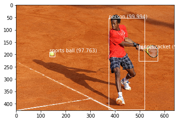
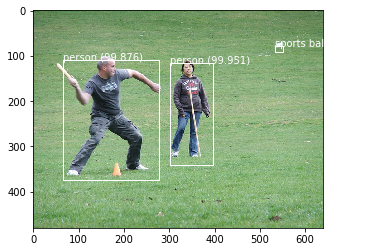
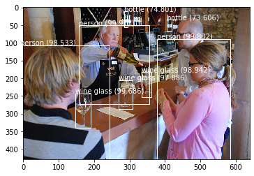
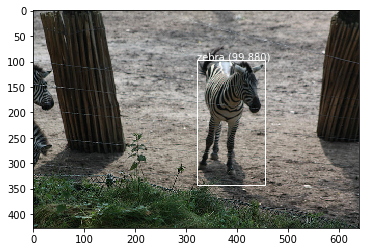

# Solutions for Optical flow e tracking
## 4 - Object detection com deep learning
Foi implementado uma rede YOLOV3 para detecção de objetos, algumas imagens do conjunto de dados COCO de testes são usadas como demostração. A yolov3 tem seu potencial no reconhecimento de objetos devido a sua velocidade.

De acordo com informações extraidas do [paper](https://arxiv.org/abs/1804.02767) a YOLOV3 tem desempenho inferior a redes como a [RetinaNet](https://arxiv.org/abs/1708.02002), porém com velocidades superior. Podendo chegar a proximo de 57 fps como a versão adaptada do [paper](https://ieeexplore.ieee.org/abstract/document/8839032), chamada de mini-yolov3.





###### Install dependences:
```sh
$ pip install tensorflow
$ pip install keras
```


### limitações dos testes 
- Retreinamento da rede, com estatísticas de treinamento, teste e validação.
- Falta uma análise detalhada de desempenho em conjunto de dados desconhecidos.
- Seria interesante um benchmark gpu e cpu.


